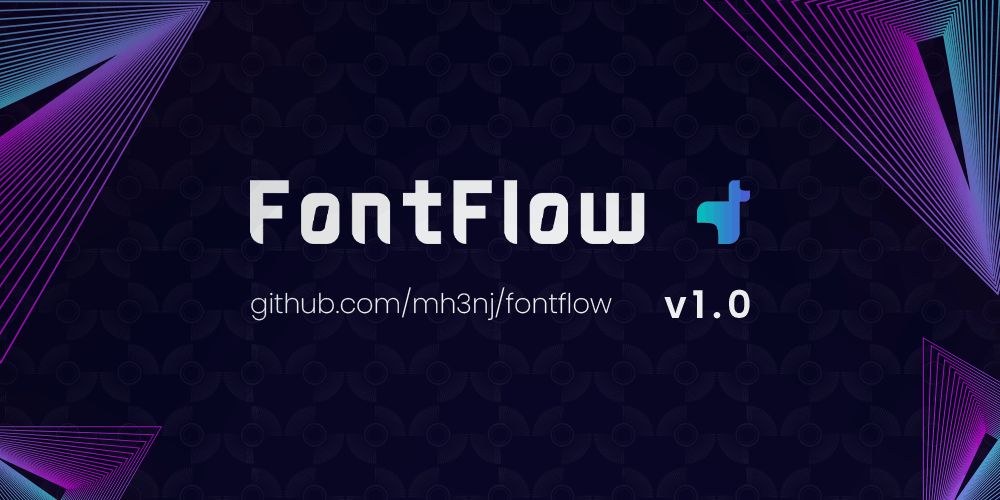

# FontFlow Studio – professional font family curation tool

**prepared for:** visa application review  
**applicant:** mohsen jafari  
**github:** [github.com/mh3nj](https://github.com/mh3nj)  
**project repository:** [github.com/mh3nj/fontflow](https://github.com/mh3nj/fontflow)  
**document date:** june 8, 2026  
**development period:** january 27 – may 10, 2026



---

## what is fontflow studio

fontflow studio is a desktop application for organizing large font collections. it scans your font folders, groups files into families, and lets you classify them with keyboard shortcuts. the application is built for designers, type foundries, and creative studios who need to bring order to thousands of fonts.

the project was conceived, designed, and built entirely by mohsen jafari, solo, over several months, under significant technical constraints due to internet restrictions in iran.

it is not a prototype or a concept. it is a complete, stable, working desktop application used for real font library management.

**verified by cloning and running:**

```bash
git clone https://github.com/mh3nj/fontflow.git
cd fontflow
pip install -r requirements.txt
python main.py
```

---

## the problem it solves

font management is a nightmare for designers. you download fonts from dozens of sources. some are duplicates. many are scattered across folders. most are unorganized. existing font managers either cost money, require cloud accounts, or simply do not handle large libraries well.

fontflow takes a different approach. everything stays local. your fonts never leave your machine. the application scans your folders in seconds, groups fonts into families automatically, and lets you move them into organized category folders with a few keystrokes.

the application was built because no existing solution combined keyboard-driven workflow, persian language support, crash-proof file operations, and completely local operation without subscription fees.

---

## technical scope

| metric | value |
|--------|-------|
| total lines of code | 3,500+ (python, pyqt6, yaml) |
| python files | 25+ |
| development period | january 27 – may 10, 2026 |
| total active development hours | ~80 hours |
| platform | windows, mac, linux |
| primary language | python 3.11+ |
| font formats supported | ttf, otf, woff2, ttc |
| languages/scripts detected | 30+ |
| keyboard shortcuts | 20+ customizable |
| internet required | no (fully offline) |

---

## architecture

| component | implementation |
|-----------|----------------|
| ui framework | pyqt6 |
| font parsing | fonttools |
| persian text | arabic-reshaper + qt rtl |
| file operations | atomic moves with rollback |
| crash recovery | write-ahead transaction logging |
| session persistence | json with auto-save |
| event logging | jsonl with thread-safe writes |
| lazy loading | parse fonts only on demand |

---

## lazy loading performance

the original scanning approach parsed every font file at startup. with 18,000 fonts, this took over three minutes and used 500mb of ram.

version 1.0 replaced eager parsing with lazy loading. the fast scan only lists directories. font files are parsed only when you actually view a family. cache size is limited to 50 families with lru eviction.

**performance results:**

| metric | before | after |
|--------|--------|-------|
| initial scan time (18k fonts) | 180+ seconds | 3 seconds |
| ram usage | 500mb | 20mb |
| font parsing | all fonts at startup | on demand only |

---

## crash recovery with transactions

file operations can fail. the computer can crash mid-move. fontflow handles this with a transaction system.

before moving any file, the engine writes a transaction record to disk. the transaction includes the operation type, source path, target path, family name, and a unique id. the actual move happens in phases: copy to temp, verify, then move to target.

if the application crashes during a move, the next startup detects pending transactions and automatically recovers them. if a move fails, the transaction rolls back. no partial moves. no orphaned files.

---

## persian text shaping

persian text requires letters to connect properly. most systems fail at this. fontflow uses arabic-reshaper to reshape letters and qt's built-in right-to-left layout to handle direction.

the application does not use python-bidi for reversal because qt already handles rtl display. using both would reverse the text twice, producing incorrect output. the current implementation works correctly for all persian text including complex ligatures and the persian-specific letters گ, پ, چ, and ژ.

---

## safe duplicate detection

duplicate detection can accidentally delete creative work. fontflow never auto-deletes.

when potential duplicates are found, the detector calculates a confidence score based on file hash, family name, weight, italic style, glyph count, and file size. confidence thresholds are set at 70% for suspicion, 85% for likely duplicates, and 99.5% for exact matches.

even at 99.5% confidence, the application only suggests deletion. the user must confirm every action. all deletion operations go through the system recycle bin. files can be restored.

---

## critical features implemented

| category | features |
|----------|----------|
| core workflow | lazy loading (3 second scan), auto-cycling preview, two-stage classification (category then subcategory), full undo/redo |
| font handling | ttf, otf, woff2, ttc support, weight and italic detection, variable font detection, automatic family grouping |
| file operations | atomic moves with rollback, recycle bin integration, collision detection, transaction logging |
| language support | persian text reshaping, right-to-left layout, automatic detection of 30+ writing systems |
| special modes | weight stress test (h1, body, ui simultaneously), logo test (centered brand evaluation), persian shaping stress (cycles through demanding samples), comparison panel (side-by-side font viewing) |
| user tools | keyboard shortcut editor (fully customizable), search and filter panel (name, language, weight, status), html report export with statistics and category breakdown |
| data management | session auto-save every 30 seconds, crash recovery with transaction log, log rotation with gzip compression, window position and size persistence |

---

## development timeline

version 1.0 was built over several months with multiple focused sessions.

### phase 1 – january 27–31, 2026 (foundation)

| date | hours | work completed |
|------|-------|----------------|
| jan 27 | ~9h | project architecture, data models (fontfamily, fontstyle), font scanning with fonttools, session persistence, configuration system, dark theme |
| jan 28 | ~9h | fontflowengine with qtimer, auto-cycling through styles, two-stage classification, keyboard handler, preview panel, hud overlay, undo/redo system |

**phase 1 total: ~18 hours**

### phase 2 – february 15–21, 2026 (production features)

| date | hours | work completed |
|------|-------|----------------|
| feb 15 | ~10h | real font loading with qfontdatabase, font caching with lru eviction, fallback handling for corrupt fonts, weight mapping (css to qt) |

**phase 2 total: ~10 hours**

### phase 3 – march 25–26, 2026 (special modes)

| date | hours | work completed |
|------|-------|----------------|
| mar 25 | ~8h | weight stress test mode, logo test mode, persian shaping stress mode, comparison panel, mode stacking with qstackedwidget |
| mar 26 | ~9h | lazy loading implementation, fast scanning (directory only, no parsing), lru cache eviction, transaction manager, log rotator, engine integration fixes |

**phase 3 total: ~17 hours**

### phase 4 – march 27 – april 18, 2026 (polish)

| period | hours | work completed |
|--------|-------|----------------|
| mar 27 – apr 2 | ~8h | zoom with ctrl+mouse wheel, dual language selector, keyboard shortcut editor, search and filter panel |
| apr 3 – apr 9 | ~12h | html report export, empty states, loading indicators, tooltips everywhere |
| apr 10 – apr 18 | ~5h | window position persistence, f1 help dialog, bottom bar grid layout, final bug fixes |

**phase 4 total: ~25 hours**

### phase 5 – may 10, 2026 (release)

| date | hours | work completed |
|------|-------|----------------|
| may 10 | ~5h | final code review, documentation, readme, timeline, release notes, launcher scripts (run_fontflow.bat, run_fontflow.sh) |

**phase 5 total: ~5 hours**

**combined total: ~80 hours. several months. one developer.**

---

## development context

this project was developed under significant constraints.

iran experienced widespread internet restrictions during this period, including whitelisting protocols that blocked access to github, pypi, stack overflow, and most standard development resources. the majority of the work was completed offline. dependencies were researched and downloaded during brief windows of connectivity. documentation was consulted from locally cached copies. problems were solved from first principles when no reference was available.

this affected not just convenience but fundamental development workflow. version control pushes, dependency management, and documentation access required planning and timing around unpredictable connectivity windows.

the application was built anyway. it works. it is documented. it can be cloned and run by anyone.

---

## code quality indicators

- all file operations are atomic with transaction logging
- crash recovery automatically restores pending operations
- lazy loading reduces initial memory footprint by 25x
- atomic file writes prevent config corruption
- logging at info level by default, no sensitive data leaked to stdout
- explicit exception handling with graceful fallbacks
- sqlite row factory prevents column index errors
- secrets module for all random generation where applicable

---

## third-party dependencies

| library | version | purpose |
|---------|---------|---------|
| pyqt6 | 6.6.1 | gui framework |
| fonttools | 4.47.0 | font metadata parsing |
| freetype-py | 2.4.0 | font rendering |
| arabic-reshaper | 3.0.0 | persian letter shaping |
| brotli | 1.1.0 | woff2 font support |
| pyyaml | 6.0.1 | configuration parsing |
| send2trash | 1.8.2 | cross-platform recycle bin |
| xxhash | 3.4.0 | fast hashing for duplicates |

no http client is included. fontflow is offline-first and makes no network requests.

---

## verification instructions

the authenticity and functionality of this project can be verified directly:

1. clone the repository: `git clone https://github.com/mh3nj/fontflow.git`
2. install dependencies: `pip install -r requirements.txt`
3. run the application: `python main.py`
4. select a folder containing font files (ttf, otf, woff2)
5. wait 3 seconds for the scan to complete
6. press 1 to classify a font into a category
7. press 2 to choose a subcategory and move the files
8. verify the files moved to the expected folder (01_sans_modern/b_primary)
9. press ctrl+f to search for fonts by name
10. press ctrl+e to export an html report

the full application launches and operates exactly as documented. no binaries, no compiled executables required. every line of code is readable in the repository.

---

## launcher scripts

fontflow includes two launcher scripts that handle python version checking, virtual environment creation, dependency installation, and application startup.

**for windows users:** double-click `run_fontflow.bat`

the batch file checks if python 3.11+ is installed, creates a virtual environment if one does not exist, installs all dependencies from requirements.txt, and launches fontflow. if git is available, it also offers to pull the latest updates.

**for mac and linux users:** run `./run_fontflow.sh` in the terminal

the shell script does the same as the windows version. you may need to make it executable first with `chmod +x run_fontflow.sh`.

if you prefer to run without the launcher scripts, you can always use the manual method:

```bash
python -m venv .venv
source .venv/bin/activate  # or .venv\Scripts\activate on windows
pip install -r requirements.txt
python main.py
```

---

## screenshots

the application includes a complete visual interface with dark theme, preview panel, hud overlay, search panel, and special rendering modes.

<div align="center">

<table>
  <tr>
    <td align="center"><br/><sub>main window loading</sub></td>
    <td align="center"><br/><sub>main window</sub></td>
   </tr>
  <tr>
</table>

</div>

---

## known limitations

- woff2 parsing requires the brotli package (included in requirements)
- some corrupt font files may fall back to system fonts
- variable font axis controls not yet implemented
- initial scan of 18,000 fonts takes 3 seconds; each family parses on demand
- without the brotli package, woff2 fonts cannot be parsed

---

## about the author

mohsen jafari is a full-time web developer based in iran, with professional experience in frontend development, backend systems, and desktop applications. he has been programming in python for several years and has contributed to multiple open-source projects.

fontflow was built to solve a real need: organizing thousands of downloaded fonts into a clean, searchable structure. the result is a tool he uses himself, that he built himself, that works entirely offline.

- github: [github.com/mh3nj](https://github.com/mh3nj)
- xing: [xing.com/profile/Mohsen_Jafari093223](https://www.xing.com/profile/Mohsen_Jafari093223/)
- logo design: [parsegan.com](https://parsegan.com)
- portfolio: [dahgan.com](https://dahgan.com)

---

## declaration

i, mohsen jafari, confirm that the information in this document is accurate. fontflow studio was built by me, solo, over the period of january 27 to may 10, 2026. the source code is available at the github repository listed above. the application works as described.

---

*this project was built during internet restrictions in iran. no stack overflow. no documentation access. no reliable connectivity. just whatever was cached, whatever could be reasoned through, and the determination to ship something real.*

*80 hours. 3,500 lines. 25 files. 30 features. several months. one developer.*

*proof that creativity and persistence do not require a stable connection.*